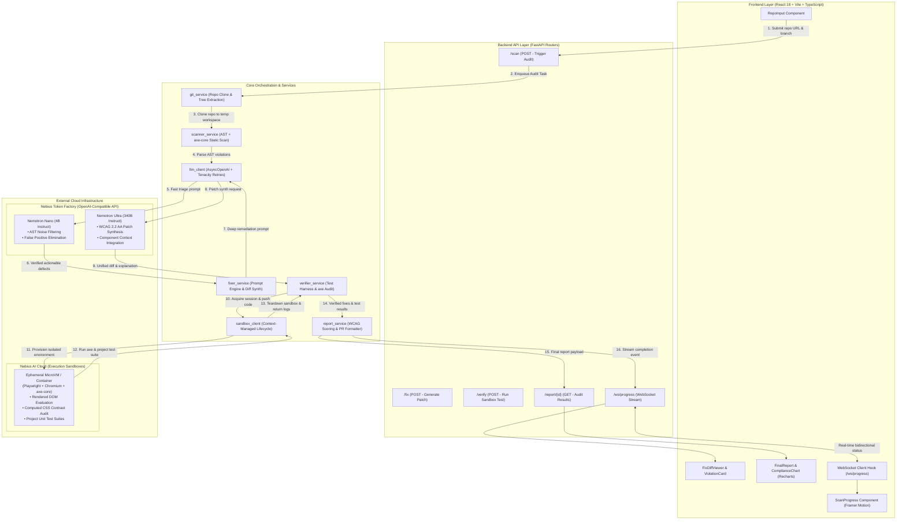
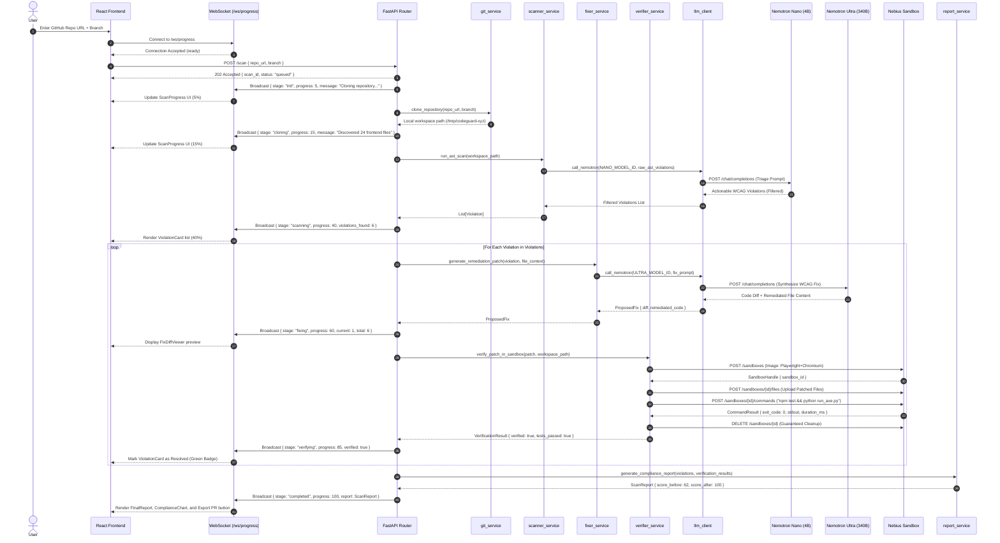

# CodeGuard System Architecture & Data-Flow Specification

This document provides the formal contract, component topology, sequence flow, and data schemas for **CodeGuard** — an autonomous accessibility remediation agent powered by **NVIDIA Nemotron** and **Nebius AI Cloud**.

---

## 1. System Topology & Architecture Diagram



---

## 2. End-to-End Sequence Diagram



---

## 3. Step-by-Step Data Flow & WebSocket Contract

### Step 1: Session Initiation & Handshake
* **Trigger**: User inputs a repository URL (e.g. `https://github.com/org/web-app`) and clicks **Scan Repo**.
* **Transport**:
  - WebSocket connection initialized at `ws://localhost:8000/ws/progress`.
  - HTTP `POST /scan` dispatched.
* **HTTP Request Body**:
  ```json
  {
    "repo_url": "https://github.com/org/web-app",
    "branch": "main"
  }
  ```
* **HTTP Response (Immediate)**:
  ```json
  {
    "scan_id": "scan_a1b2c3d4",
    "status": "queued",
    "created_at": "2026-09-27T19:30:00Z"
  }
  ```
* **WebSocket Event**:
  ```json
  {
    "stage": "init",
    "scan_id": "scan_a1b2c3d4",
    "progress": 5,
    "message": "Initialized scan request. Connecting to repository...",
    "timestamp": "2026-09-27T19:30:01Z"
  }
  ```

---

### Step 2: Ingestion & File Tree Discovery (`git_service`)
* **Operation**: GitPython performs a shallow clone (`--depth 1`) into an isolated temporary folder. Scans the workspace tree for files ending in `.tsx`, `.jsx`, `.html`, `.vue`, `.svelte`.
* **Internal Data Output**: `workspace_path: Path`, `target_files: List[Path]`.
* **WebSocket Event**:
  ```json
  {
    "stage": "cloning",
    "scan_id": "scan_a1b2c3d4",
    "progress": 15,
    "message": "Repository cloned successfully. Discovered 18 frontend components.",
    "data": {
      "branch": "main",
      "file_count": 18,
      "files": ["src/components/Header.tsx", "src/pages/Login.tsx"]
    },
    "timestamp": "2026-09-27T19:30:04Z"
  }
  ```

---

### Step 3: Accessibility Scanning & Nano Triage (`scanner_service`)
* **Operation**: Static AST analysis uncovers missing `alt` attributes, unassociated `<label>` elements, invalid ARIA roles, and keyboard navigation issues.
* **LLM Call**: Calls `Nemotron-Nano` via `llm_client.call_nemotron` to triage warnings:
  ```text
  Prompt: "Given these raw AST a11y violations in Login.tsx, eliminate false positives where aria-labelledby is dynamically assigned, and return verified WCAG 2.2 AA violations in JSON."
  ```
* **Internal Data Output**: `List[Violation]`.
* **WebSocket Event**:
  ```json
  {
    "stage": "scanning",
    "scan_id": "scan_a1b2c3d4",
    "progress": 40,
    "message": "Accessibility audit complete: 4 actionable violations detected.",
    "data": {
      "violations_count": 4,
      "violations": [
        {
          "id": "viol_01",
          "file": "src/components/Header.tsx",
          "line": 42,
          "type": "color-contrast",
          "severity": "critical",
          "description": "Elements must meet minimum color contrast ratio threshold (3.1:1 found, 4.5:1 required).",
          "selector": "button.btn-primary",
          "context_snippet": "<button className=\"text-slate-400 bg-slate-900\">Submit</button>"
        }
      ]
    },
    "timestamp": "2026-09-27T19:30:10Z"
  }
  ```

---

### Step 4: Remediation Patch Synthesis (`fixer_service`)
* **Operation**: For each violation, context extraction pulls 30 lines above and below the violating element, plus design system tokens.
* **LLM Call**: Calls `Nemotron-Ultra` (340B) via `llm_client.call_nemotron`:
  ```text
  Prompt: "Synthesize a minimal, non-breaking WCAG 2.2 AA compliant fix for this button. Return the unified git diff and updated component code."
  ```
* **Internal Data Output**: `ProposedFix`.
* **WebSocket Event**:
  ```json
  {
    "stage": "fixing",
    "scan_id": "scan_a1b2c3d4",
    "progress": 65,
    "message": "Synthesized remediation patch for viol_01 in Header.tsx.",
    "data": {
      "violation_id": "viol_01",
      "fix_id": "fix_01",
      "explanation": "Updated text color to text-slate-100 to increase contrast ratio from 3.1:1 to 5.4:1.",
      "diff": "@@ -42,1 +42,1 @@\n-<button className=\"text-slate-400 bg-slate-900\">Submit</button>\n+<button className=\"text-slate-100 bg-slate-900\">Submit</button>"
    },
    "timestamp": "2026-09-27T19:30:18Z"
  }
  ```

---

### Step 5: Ephemeral Sandbox Verification (`verifier_service`)
* **Operation**: Uses `async with sandbox_session() as sandbox:`:
  1. Calls Nebius API `POST /sandboxes` to spawn container.
  2. Calls `upload_files` to push patched components.
  3. Executes `npm test` and axe-core Playwright evaluation inside sandbox.
  4. Confirms violation is resolved and 0 unit test regressions occurred.
  5. Destroys sandbox in `finally` block.
* **Internal Data Output**: `VerificationResult`.
* **WebSocket Event**:
  ```json
  {
    "stage": "verifying",
    "scan_id": "scan_a1b2c3d4",
    "progress": 85,
    "message": "Patch fix_01 verified in Nebius Sandbox with 0 test regressions.",
    "data": {
      "fix_id": "fix_01",
      "violation_id": "viol_01",
      "verified": true,
      "tests_passed": true,
      "axe_score_before": 62.5,
      "axe_score_after": 100.0,
      "duration_ms": 1420.0
    },
    "timestamp": "2026-09-27T19:30:26Z"
  }
  ```

---

### Step 6: Audit Finalization & Reporting (`report_service`)
* **Operation**: Calculates compliance improvement, formats audit summary, prepares Git patch branch.
* **HTTP Endpoint**: `GET /report/{scan_id}` returns final `ScanReport`.
* **WebSocket Event**:
  ```json
  {
    "stage": "completed",
    "scan_id": "scan_a1b2c3d4",
    "progress": 100,
    "message": "All violations remediated and verified in Nebius Sandboxes.",
    "data": {
      "overall_score_before": 62.5,
      "overall_score_after": 100.0,
      "total_violations": 4,
      "resolved_violations": 4,
      "unresolved_violations": 0
    },
    "timestamp": "2026-09-27T19:30:28Z"
  }
  ```

---

## 4. Core Pydantic Schemas

Below are the contract definitions that unify the backend models, router responses, and frontend TypeScript typings.

```python
from datetime import datetime
from enum import Enum
from typing import Any, Dict, List, Optional
from pydantic import BaseModel, Field


class ViolationSeverity(str, Enum):
    CRITICAL = "critical"
    SERIOUS = "serious"
    MODERATE = "moderate"
    MINOR = "minor"


class PipelineStage(str, Enum):
    INIT = "init"
    CLONING = "cloning"
    SCANNING = "scanning"
    FIXING = "fixing"
    VERIFYING = "verifying"
    COMPLETED = "completed"
    ERROR = "error"


class Violation(BaseModel):
    """Represents a specific accessibility defect identified in source code."""
    id: str = Field(description="Unique violation identifier (e.g. 'viol_01')")
    file: str = Field(description="Relative repository path to violating file")
    line: Optional[int] = Field(default=None, description="Starting line number in file")
    type: str = Field(description="WCAG Rule identifier (e.g. 'color-contrast', 'image-alt')")
    severity: ViolationSeverity = Field(description="Impact severity rating")
    description: str = Field(description="Human-readable WCAG defect explanation")
    selector: Optional[str] = Field(default=None, description="DOM or JSX element selector")
    context_snippet: Optional[str] = Field(default=None, description="Original offending code snippet")


class ProposedFix(BaseModel):
    """Represents an AI-synthesized remediation patch generated by Nemotron Ultra."""
    fix_id: str = Field(description="Unique fix identifier")
    violation_id: str = Field(description="Associated violation identifier")
    diff: str = Field(description="Unified git diff string")
    explanation: str = Field(description="Rationale detailing how the fix achieves WCAG compliance")
    original_code: str = Field(description="Original unpatched code block")
    remediated_code: str = Field(description="New accessible replacement code block")


class VerificationResult(BaseModel):
    """Outcome of executing the patched codebase within an isolated Nebius Sandbox."""
    fix_id: str = Field(description="Identifier of verified fix")
    violation_id: str = Field(description="Identifier of verified violation")
    axe_score_before: float = Field(description="Axe-core compliance score before remediation (0-100)")
    axe_score_after: float = Field(description="Axe-core compliance score after remediation (0-100)")
    tests_passed: bool = Field(description="Whether repository unit/regression tests passed cleanly")
    violations_resolved: bool = Field(description="Whether axe-core confirmed the defect was resolved")
    verified: bool = Field(description="True if both tests passed and violation resolved with 0 regressions")
    sandbox_id: Optional[str] = Field(default=None, description="Nebius sandbox execution container ID")
    sandbox_logs: Optional[str] = Field(default=None, description="Captured stdout/stderr from verification run")


class ScanReport(BaseModel):
    """Comprehensive accessibility audit report delivered to the frontend dashboard."""
    scan_id: str = Field(description="Unique scan job identifier")
    repo_url: str = Field(description="Target repository URL")
    branch: str = Field(default="main", description="Target git branch audited")
    violations: List[Violation] = Field(default_factory=list, description="All detected accessibility violations")
    fixes: List[ProposedFix] = Field(default_factory=list, description="All synthesized remediation patches")
    verification_results: List[VerificationResult] = Field(
        default_factory=list, description="Sandbox verification logs and test statuses"
    )
    overall_score_before: float = Field(description="Baseline repository WCAG compliance percentage")
    overall_score_after: float = Field(description="Post-remediation WCAG compliance percentage")
    timestamp: datetime = Field(default_factory=datetime.utcnow, description="UTC completion timestamp")
    status: str = Field(default="completed", description="Overall execution status")


class WebSocketProgressMessage(BaseModel):
    """Message schema streamed over /ws/progress to drive real-time dashboard animations."""
    stage: PipelineStage = Field(description="Current active pipeline stage")
    scan_id: str = Field(description="Current scan identifier")
    progress: int = Field(ge=0, le=100, description="Pipeline completion percentage (0-100)")
    message: str = Field(description="Human-readable status update text")
    data: Optional[Dict[str, Any]] = Field(default=None, description="Contextual payload (violations, diffs, scores)")
    timestamp: datetime = Field(default_factory=datetime.utcnow, description="Message generation timestamp")
```
